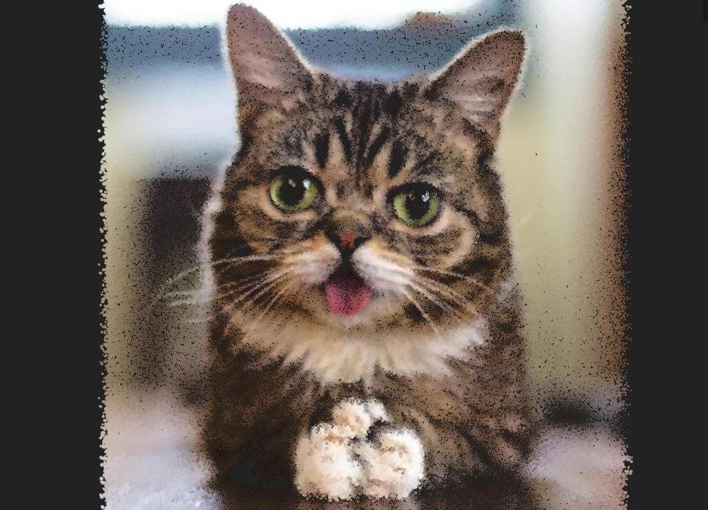

# Interactive Particles with Three.js

A tutorial demonstrating how to draw a large number of particles with Three.js and an efficient way to make them react to mouse and touch input using an off-screen texture.

## Run
- Install `npm install`
- Run `npm start`
- Build `npm run build`

## Libraries
- [ControlKit](https://github.com/brunoimbrizi/controlkit.js) - GUI
- [gsap](https://www.npmjs.com/package/gsap) - animation platform
- [glslify](https://github.com/glslify/glslify) - module system for GLSL
- [stats.js](https://github.com/mrdoob/stats.js/) - performance monitor
- [Three.js](https://github.com/mrdoob/three.js/) - WebGL library
